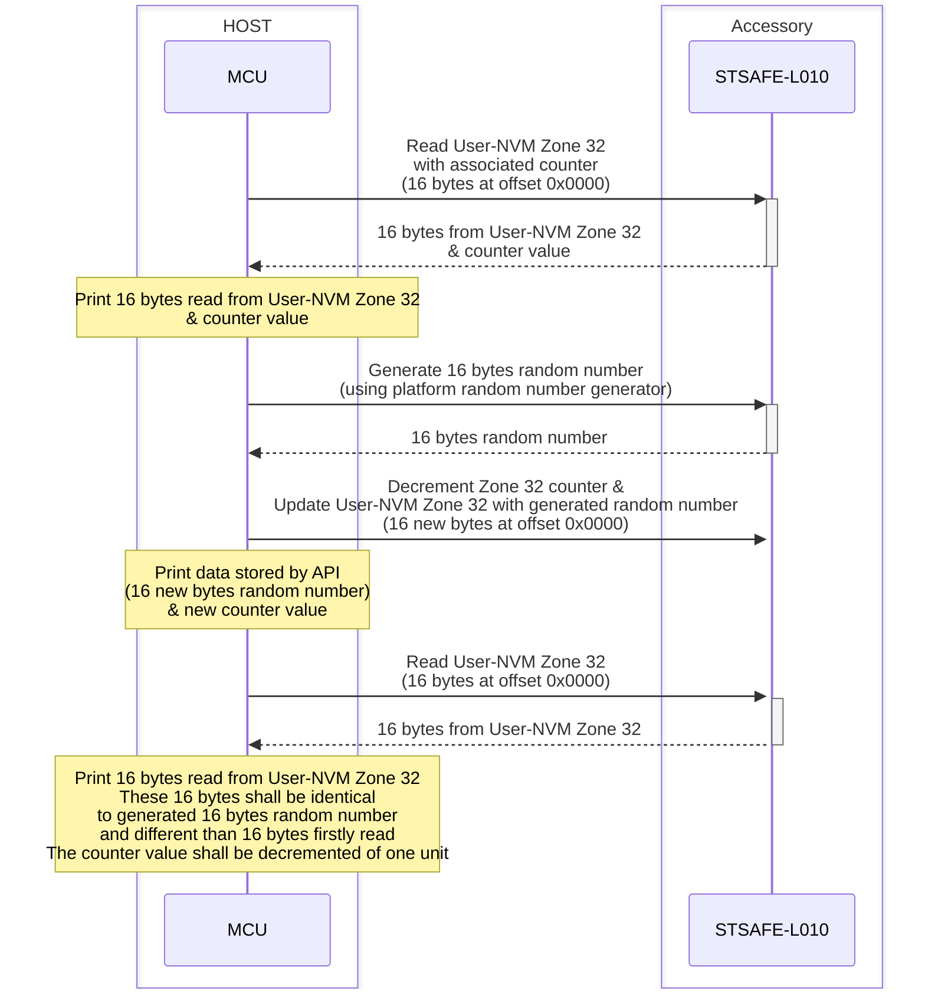
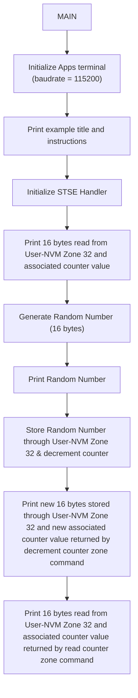
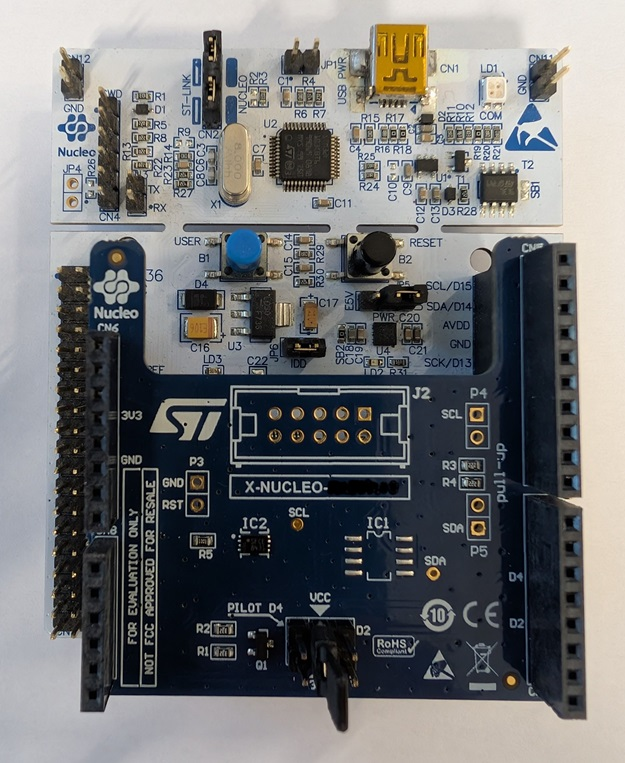

# STSAFE-L010 Secure data storage
This project illustrates how to use the STSAFE-L010 Secure Element and STMicroelectronics Secure Element Library to perform data storage through STSAFE-L010 Secure Element.
When loaded on the target MCU platform , the project performes the storage of 100 bytes through STSAFE-L010 User-NVM Zone 32. This storage scheme is typically used to store data securely.

The example applicative flowchart is illustrated below :

STSELib API used in the example are the following :

- stse_set_default_handler_value
- stse_init
- stse_data_storage_read_counter_zone
- rng_generate_random_number
- stse_data_storage_decrement_counter_zone

## Hardware and Software Prerequisites

- [NUCLEO-L452RE - STM32L452RE evaluation board](https://www.st.com/en/evaluation-tools/nucleo-l452re.html)

- [X-NUCLEO-ESE02A1 - STSAFE-L010 Secure element expansion board](https://www.st.com/en/ecosystems/x-nucleo-ese02a1.html)

- [STM32CubeIDE - Integrated Development Environment for STM32](https://www.st.com/en/development-tools/stm32cubeide.html)

- Serial terminal PC software  (i.e. Teraterm)

## Getting started with the project

- Connect the [X-NUCLEO-ESE02A1](https://www.st.com/en/ecosystems/x-nucleo-ese02a1.html) expansion board on the top of the [NUCLEO-L452RE](https://www.st.com/en/evaluation-tools/nucleo-l452re.html) evaluation board.

- Connect the board to the development computer and Open and configure a terminal software as follow (i.e. Teraterm).

- Open the STM32CubeIDE projects located in Application/STM32CubeIDE

- Build the project by clicking the “**Build the active configurations of selected projects\ **” button and verify that no error is reported by the GCC compiler/Linker.

- Launch a debug session then wait the debugger to stop on the first main routine instruction and press Start button to execute the main routine.

> [!NOTE]
> - Power configuation Jumper must be set to 3V3-VCC.
> - The COM port can differ from board to board. Please refer to windows device manager.

<b>Result</b> :

This project reports execution log through the on-board STLINK CDC bridge.
These logs can be analyzed on development computer using a serial terminal application (i.e.: Teraterm).
As example below.

<pre>
----------------------------------------------------------------------------------------------------------------
-                            STSAFE-L010 secure data storage counter zone access example                            -
----------------------------------------------------------------------------------------------------------------
-                                                                                                              -
- description :                                                                                                -
- This examples illustrates how to makes use of the STSAFE-L data storage APIs by performing following         -
- accesses/commands to the target STSAFE device                                                                -
-          o Query STSAFE-L total partition count                                                              -
-          o Query STSAFE-L partitions information                                                             -
-          o Read STSAFE-L zone ZONE_INDEX counter                                                             -
-          o decrement STSAFE-L zone ZONE_INDEX counter                                                        -
-          o Update STSAFE-L counter zone ZONE_INDEX                                                           -
-                                                                                                              -
- Note : zone IDs used in this example are aligned with STSAFE-L010 personalization                            -
-        Accesses parameters must be adapted for other device personalization                                  -
-                                                                                                              -
----------------------------------------------------------------------------------------------------------------
 - Initialize target STSAFE-L010

 - stse_data_storage_read_data_zone (zone : 32 - length : 16 - counter : 16777202)
  0x01 0x30 0x3D 0x30 0x3B 0x27 0x15 0x12 0xC4 0x9F 0x56 0xE9 0x12 0x0B 0xA5 0xB9

 - stse_data_storage_decrement_counter_zone (zone = 32 - length = 16 - New counter : 16777201)
  0x9D 0x8D 0x27 0x82 0x6E 0x9D 0xEF 0x80 0x24 0x16 0x0E 0x31 0xDD 0xC1 0x6E 0x4A

 - stse_data_storage_read_data_zone (zone : 32 - length : 16 - counter : 16777201)
  0x9D 0x8D 0x27 0x82 0x6E 0x9D 0xEF 0x80 0x24 0x16 0x0E 0x31 0xDD 0xC1 0x6E 0x4A
</pre>

 ## How to adapt the exemple

 Each STSE handler contains SE's informations mandatory by the STSELib to manage correctly targeted API and services.
-	device_type : STSAFE-A100/ STSAFE-A110/ STSAFE-A120
-	pPersoInfo  : pointer to a specific device perso configuration
-	pActive_host_session : active host session managed by the open session API set
-	pActive_other_session : other session managed by the open session API set.
-	Io : communication bus description like I2C device address , I2C speed
